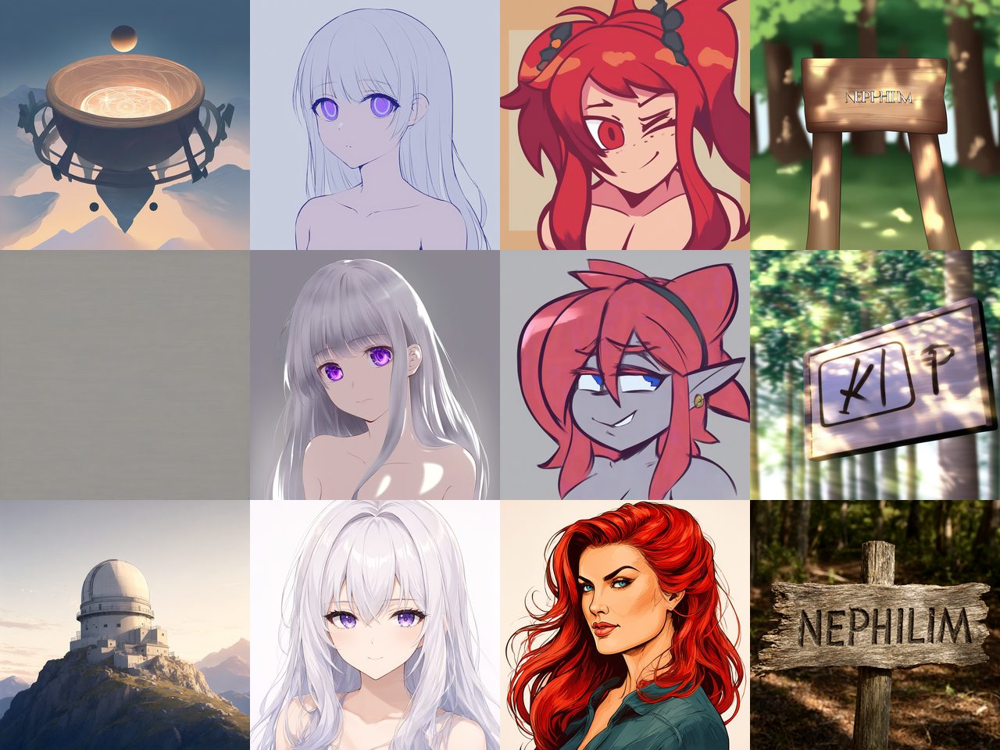

# Bake-off verdict — 2026-10-02

12 images, 3 candidates x 4 prompts, same seed, 1024x1024, scored against
RUBRIC.md which was fixed before any image was viewed.

*Rows: NoobAI-XL, Pony V6, Qwen-Image-2.1. Columns: illustration, anime portrait,
cartoon portrait, text render. Pony's blank frame is the top-middle-left cell.*
Full-resolution originals are at `~/image-gen/bakeoff/out/` (13 PNGs, ~14 MB, not
committed).

## Scores (1-5, "usable as-is" in brackets where it differs)

| Prompt | NoobAI-XL | Pony V6 | Qwen-Image-2.1 |
|---|---|---|---|
| A — general illustration | **1.5** cauldron, not an observatory | **0** BLANK FRAME | **5** |
| B — anime portrait | 3.5 [3] washed out, no rim light | **4.5** [4] | **4.5** [4.5] |
| C — western-cartoon portrait | 4 [2.5] invented horns + wink | 3.5 [2] invented grey skin + elf ears | **5** [5] no drift |
| D — text in image | 3.5 [2] "NEPHIHIM" | 3.5 [1] glyphs | **5** "NEPHILIM" exact |

Measured on this machine, not borrowed:
- SDXL 1024/30 steps: **94-104 s**
- Qwen-2.1 q8 1024/25 steps: **332-333 s** (13.3 s/step), peak ~20 GB at 512
- Qwen-2.1 download: 41m53s, ~32 GB, paid once

## The verdict

**Qwen-Image-2.1 wins decisively: 3 of 4 outright, tied on the fourth.**

The standing record in `nephilim/docs/research/persona_image_generation_2026-08-19.md`
says "model size != anime/cartoon quality — SDXL specialists beat much larger
general models at THIS aesthetic". **On this evidence that is wrong**, and it
should be amended rather than defended.

### Three findings that matter more than the ranking

1. **Pony V6 returned a BLANK FRAME for the illustration prompt.** Measured,
   not eyeballed: std 5.84 and 2,223 unique colours against 24-98 and 44k-188k
   everywhere else. It is a character model and produces nothing outside that.
   This disqualifies it for eeva by itself.

2. **The specialists invent a different character; Qwen renders the one
   described.** Unprompted across the SDXL cells: horns, a wink, grey skin,
   pointed elf ears, bare shoulders. Qwen's C has none — she is clothed, red
   haired, confident, three-quarter view, exactly as written.

   This is the load-bearing finding, and it inverts the identity argument. The
   record reasons "identity = the LoRA" because a prompt cannot hold an
   appearance. That is true *of the specialists*, and it is true **because they
   drift**. A model that renders the description is a model a versioned
   appearance block can actually steer — which makes reference conditioning
   plausible where it was not before.

3. **Qwen is not bad at anime.** It tied Pony and beat NoobAI on B. That
   contradicts both the standing record and the hands-on test published three
   days after 2.1's release. Held lightly at n=1, but it is a clean sample.

## What this does NOT settle — stated plainly

- **One image per cell, one seed.** A screen, not a benchmark. It can
  eliminate a candidate and show a large gap; it cannot resolve a close one.
  The A and C gaps are large. The B gap is not, and should not be leaned on.
- **Identity ACROSS generations is untested.** Whether gwen is recognisably
  herself twice is the question her portraits actually need answered, and
  nothing here touches it. Finding 2 makes it *more* likely to be solvable by
  reference conditioning — it does not demonstrate it.
- **Qwen-Image-2512 was not tested.** The Apache-2.0 sibling, ~100 Elo below
  2.1 on independent boards but 6th on Portraits. If the licence ever matters
  it must be bench-tested separately, not assumed.
- **Anima was not tested.** The 2B anime-native model remains an untested
  candidate for the anime personas specifically.
- **Licence:** Qwen-Image-2.1 is the Qwen RESEARCH LICENSE — non-commercial.
  Fine for private self-hosted use, a wall if nephilim ever ships.
